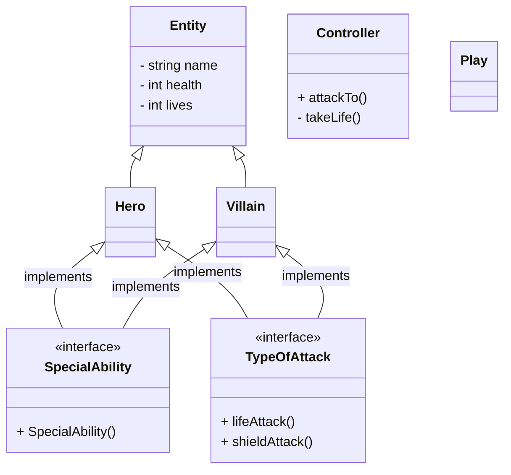

# ROBOT WAR 

this is a simple application, in which I practice the functionalities of maven, and practice testing with JUnit

```mermaid
classDiagram
    class Entity{
        - string name
        - int health
        - int lives
    }
        
    class SpecialAbility{
        <<interface>>
        + SpecialAbility()
    }
    
    class TypeOfAttack{
        <<interface>>
        + lifeAttack()
        + shieldAttack()
    }
    
    class Hero{
        
    }
    class Villain{
        
    }
    
    class Controller{
        + attackTo ()
        - takeLife()
    } 
    
    class Play{
        
    } 
    
    Entity <|-- Hero  
    Entity <|-- Villain
    Hero <|-- SpecialAbility : implements 
    Hero <|-- TypeOfAttack :implements
    Villain <|-- TypeOfAttack : implements 
    Villain <|-- SpecialAbility : implements


```